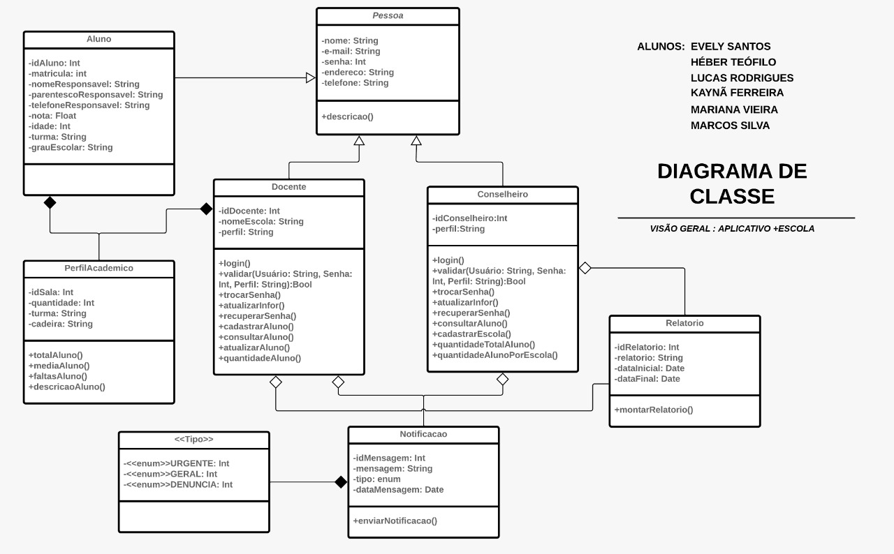
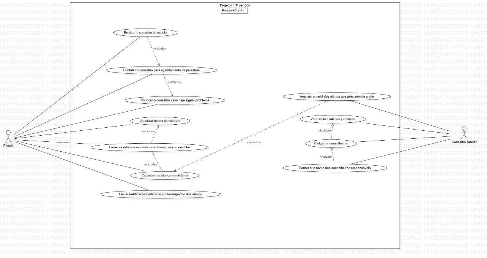

# Projeto-Escola
Repositório do Projeto Integrador 3° Período - 2022 

## Nosso Projeto
Nosso projeto surgiu devido a falta da comunicação correta entre o conselho tutelar e instituições de ensino infanto-juvenil particulares e públicas.
## Veja o desenvolvimento do projeto:

Para ver o desenvolvimento, acesse o planejamento:

# Ferramentas e Tecnologias Envolvidas:

## 🤝 Colaboradores

Agradecemos às seguintes pessoas que contribuíram para este projeto:
* Evely Santos da Silva
* Héber Teófilo Fonteles
* Kaynã Ferreira Vitorino da Silva
* Lucas Rodrigues Melo
* Mariana de Souza Vieira da Silva
* Marcos Maia
## Modelagem do Sistema:
* Diagrama de caso de uso

* Diagrama de Caso de Uso

Copyright © 2022 +Escola

